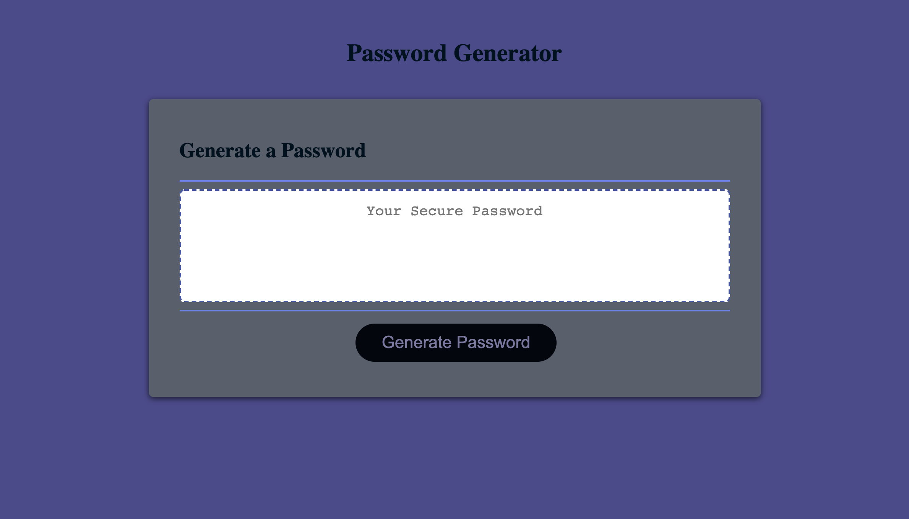

# JS-Pasword_Generator

### This project was an activity on creating a possword generator using a already completed html and css sheets, but creating all of the Javascript. When this is done a password generator is created and takes into consideration how specific the user wants their password to be, using capital and lowercase letters, numbers and special characters. 

***

[Password Generator](https://kemwalsh.github.io/JS-Pasword_Generator/)